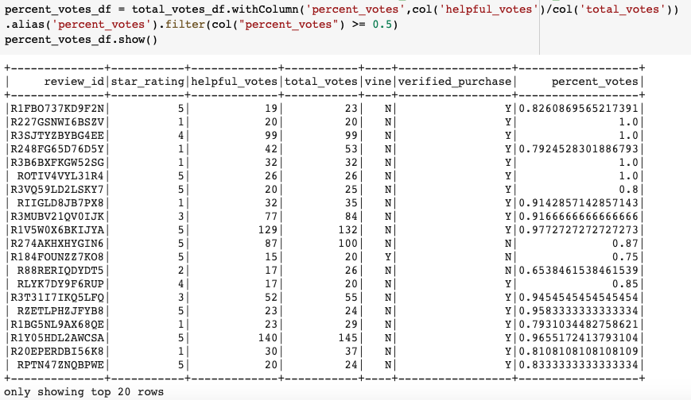
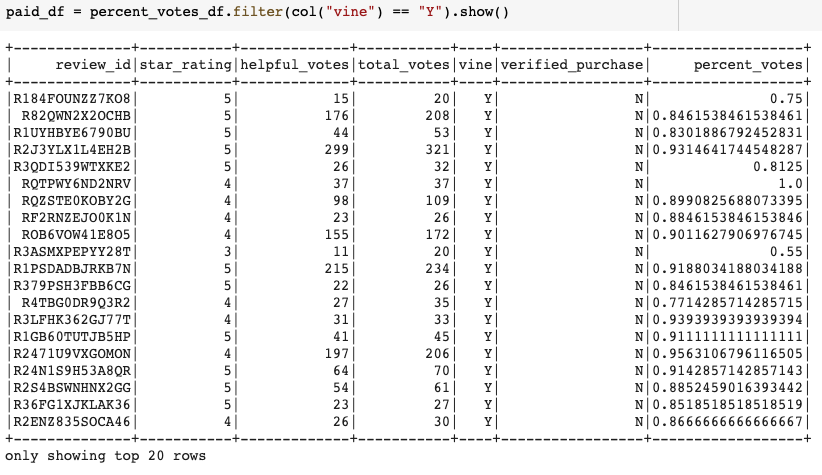
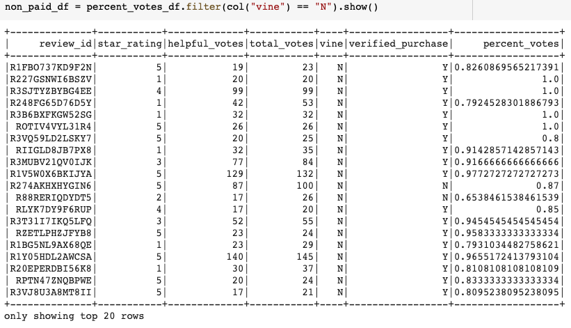

# Amazon_Vine_Analysis
Big Data analysis using Google Colab, Pyspark, Postgres/pgAdmin, AWS RDS, Pandas and SQL

## Overview

The purpose of this project is to analyze Amazon reviews written by members of the paid **Amazon Vine program**, a service that allows manufacturers and publishers to receive reviews of their products and determine if there are any biases between **Vine** members and **Non-Vine** member's reviews. 

Companies that will pay a fee to Amazon and may provide free products to Vine members who are then required to publish a review. In order to determine if there is any bias towards favorable reviews from Vine members vs. non-members, we need to identify the percentage of 5 star ratings to total rating. As part of this exercise, we were asked to choose from 50 datasets to extract, transform and load into a dataframe in order to complete our analysis. Throughout this analysis, we use:

* `PySpark` to extract the dataset, transform the data, connect to `AWS RDS` instance and load the transformed data into `pgAdmin`.
* `Google Colaboratory` to import `PySpark` libraries and connect to `Postgres` in order to create `SQL` tables and export the results. 

Of the 50 datasets, we chose to analyze reviews that were made by users in the **"Electronics"** category. 

Dataset used for this analysis can be found [here](https://s3.amazonaws.com/amazon-reviews-pds/tsv/amazon_reviews_us_Electronics_v1_00.tsv.gz)

## Results

The dataset had over 3 million reviews recorded. In order to focus on reviews that would be considered more likely to be helpful, we needed to filter the dataset by:

* Count of Total Votes equal or greater than 20. 
* Percent of Helpful Votes to Total Votes equal or greater than 50%. 

The results reduced the total number of reviews from 3M to 50.7K. This allowed us to answer the following questions:

**1. How many Vine reviews and non-Vine reviews were there?**

* **Vine** members made up only 2.1% (1,080) of the reviews whereas the remaining 97.9% were **Non-Vine** members (49,659).

**2. How many Vine reviews were 5 stars? How many non-Vine reviews were 5 stars?**

* **Vine** members gave 454 out of 1,080 reviews a 5 star rating.
* **Non-Vine** members gave 23,034 out of 49,659 reviews a 5 star rating.

**3. What percentage of Vine reviews were 5 stars? What percentage of non-Vine reviews were 5 stars?**

* 42% of the reviews for **Vine** members were rated 5 stars.
* 46.4% of the reviews for **Non-Vine** members were rated 5 stars.

## Summary

Based on the results, **Vine** members did not show bias when rating their products considering that the number of 5-star ratings was about 10% less than **Non-Vine** members (42% vs. 46.4%). With this, we can assume that Vine customers are more critical when submitting their review. However, in order to support this assumption further, we should include all of the data rather than filtering it to a percentage of helpful vs. total votes as we did for this analysis. Reviewing the data as is would give us more information and allow us to further support our assumption as shown below. 

In addition, running the same analysis using datasets from different product categories can provide us with the whole picture of whether reviews made by **Vine** members are bias.
